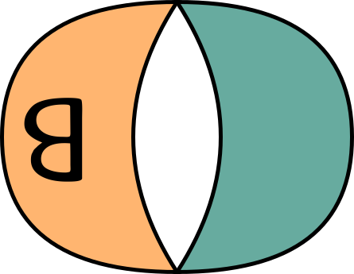
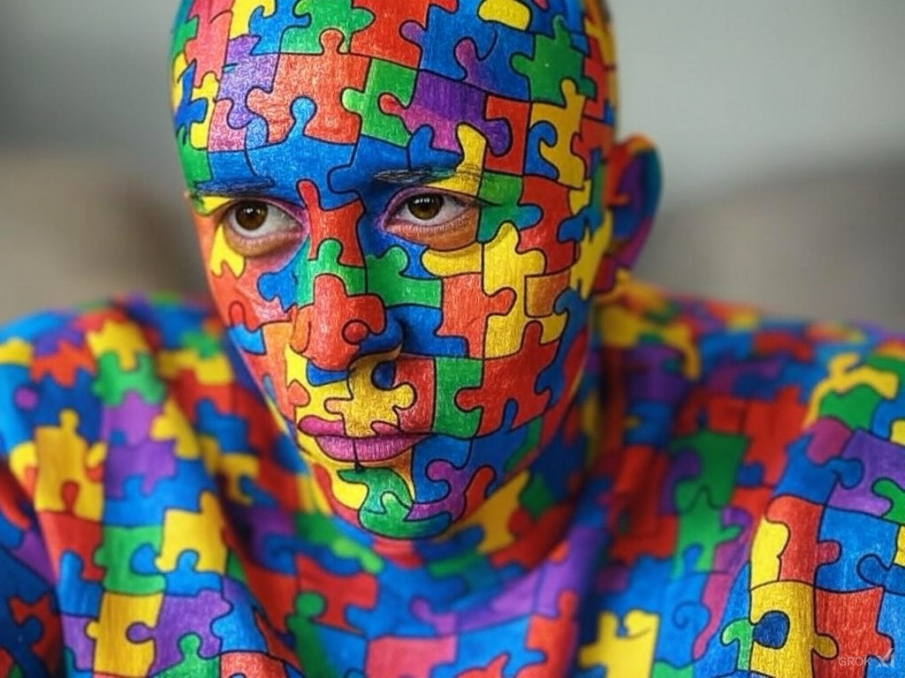

> "If you can't even clean up your own room, who the hell are you to give advice to the world? 
> — <cite>Jordan B. Peterson</cite>
<!-- ## Explore


  
  
 -->

## Introduction

Hello. You have reached a website that really is ambitious but slow to take off. Just look at when this domain name (*beingautistic.co.uk*) was first registered. I'll cut the long story of multiple attempts to launch this website/blog. I have personally wanted to log my thoughts to the world without any agenda or filter.

Here's what will likely happen...

| *1) Some sort of real-time thought dump of current affairs* | <iframe src="https://giphy.com/embed/WsNbxuFkLi3IuGI9NU" width="300" style="" frameBorder="0" class="giphy-embed" allowFullScreen></iframe>

| --- | --- |
| > | Does this table merge? |

I don't want a structured blog anymore. But somewhere to write down 500 word*ish* pieces that indicate where my head is at on a topic.

| *2) A place to challenge autism, neurodiveristy  and whatever else in society.* |  |
------------ | -------------

### *2) A place to challenge autism, neurodiveristy and whatever else in society.*

> GrokAI generated image - "generate me an image that represents autism" > "apply the image on a person"